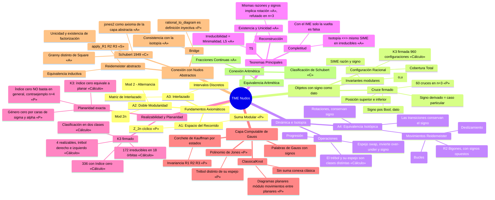

# Mapa Mental: Teoría Modular Estructural de Nudos (TME)

Este diagrama visualiza el eje discursivo de la teoría, desde sus axiomas fundamentales hasta los teoremas de clasificación. Refleja el estado del código a **2026-10-01** (`master` en `211d1d6`), tras migrar la teoría al **signo del cruce como dato**.

**Cómo leerlo.** Cada resultado lleva una marca de estado:
`«P»` demostrado en Lean (solo con `propext`, `Classical.choice`, `Quot.sound`) ·
`«A»` descansa en un axioma declarado · `«S»` contiene un `sorry` · `«C»` axioma citado de la literatura · `«Cálculo»` verificado por `decide +kernel` sobre un espacio finito.

## Estado de la formalización (conteos verificados)

| Capa | Estado |
|---|---|
| Módulos de `TMENudos/` | 47 compilan por nombre, 0 errores |
| Axiomas declarados | 50 (Schubert 25, Reidemeister 11, Basic 5, KN_01 5, Bridge 1, y uno en `KN_00`, `TCN_01` y `TCN_08_Uniformity`) |
| `sorry` | 17 (Schubert 11, Reidemeister 4, `KN_00_Combinatoria` 1, `KN_Instance_K3` 1) |
| Capa de Gauss, planaridad y `ClassicalKnot` | sin `sorry` ni axiomas propios; fuera de la build por defecto (módulos `Etapa1_*`) |

## Descripción del Eje Discursivo

1. **Fundamentación**: La teoría parte de definir un espacio discreto y finito (`ℝ[n]`) donde "habitan" los nudos, regido por aritmética modular.
2. **Estructuración**: Sobre este espacio se definen los **Cruces** y su **Interlazado**, creando la `RationalConfiguration`. Cada cruce lleva ahora un **signo como dato**: derivarlo de las posiciones perdía la quiralidad, porque en las parejas antipodales el intercambio no cambia el signo y el trébol y su espejo se confundían.
3. **Caracterización**: Se extrae la esencia del nudo en el **IME** (razones modulares) y, con el signo como dato, en el **SIME** (razón y signo de cada cruce).
4. **Dinámica**: Se define cuándo dos nudos son equivalentes (`Isotopic`) mediante movimientos locales (R1, R2 con signos opuestos, R3) y globales (rotación). Todas las transiciones conservan el signo.
5. **Clasificación**: Dos nudos irreducibles son iguales si y solo si sus SIME son iguales, bajo los axiomas de reconstrucción, minimalidad y unicidad (`«A»`). Con el IME solo, la implicación recíproca es falsa.
6. **Realizabilidad**: Entre las configuraciones de tres cruces, las realizables (irreducibles, de paridad de Gauss par y de **índice cero**) son exactamente el trébol derecho y el izquierdo. El índice cero es una condición necesaria de planaridad que coincide con ella para K₃, pero **no basta en general**: hay un contraejemplo con cuatro cruces.
7. **Capa computable**: Las palabras de Gauss con signos, el corchete de Kauffman y el polinomio de Jones están demostrados invariantes bajo R1, R2 y R3. Con el Jones se prueba que el trébol y su espejo son nudos distintos. La noción de nudo clásico (`ClassicalKnot`) exige pasar solo por diagramas planares.
8. **Puente Aritmético y abstracto**: Se conecta esta visión combinatoria con la teoría clásica de fracciones continuas y con el teorema de Schubert (axiomas citados), y con los nudos abstractos mediante `Bridge`.

## Límites que el mapa no debe ocultar

- Los teoremas de clasificación general (forma normal, completitud, reconstrucción) descansan en **axiomas**, no están demostrados desde cero.
- La factorización de Schubert y el Jones de la capa abstracta (`jones2`) son **axiomas** de la capa abstracta; solo el cálculo concreto sobre palabras de Gauss está demostrado.
- Que *planar implica índice cero* se comprobó solo hasta n = 4 por cálculo; no es teorema.
- `ClassicalKnot` no tiene operación espejo general ni suma conexa (exige pegar en la misma cara).
