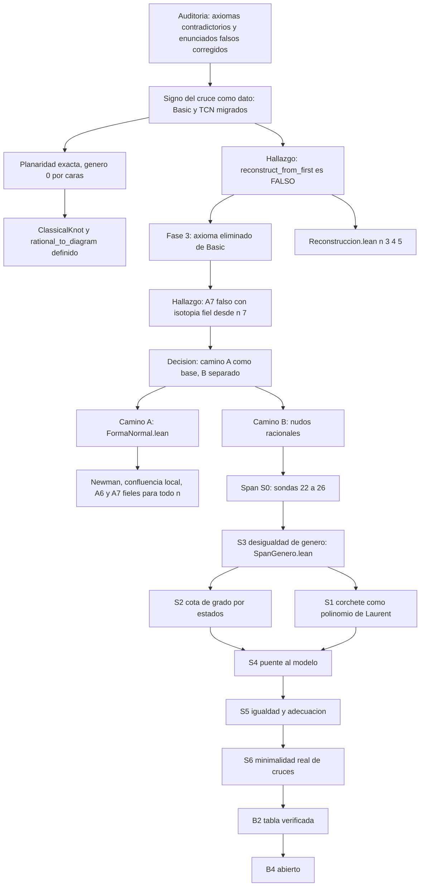

# Mapa de la ruta — bitácora del 2026-10-01 (21:49)

**Estado de partida de este mapa:** `master` = `origin/master` = `d455b19` (publicado). Autor: Pablo Eduardo Cancino Marentes.
Este documento resume la ruta recorrida y la que queda, a partir de todo lo trabajado entre el 29 de septiembre y el 1 de octubre de 2026.
Es un MAPA: cada tramo remite a su documento de detalle. Convención de estado: **[HECHO]** demostrado y verificado en Lean; **[CÁLCULO]** comprobado
por cálculo, no demostrado; **[ABIERTO]** sin resolver; **[SOSPECHOSO]** descansa en un axioma no verificado.

## 1. Vista general

## 2. Lo recorrido (HECHO y publicado en `origin`)

| Tramo | Resultado | Dónde |
|---|---|---|
| Auditoría | Cinco axiomas contradictorios y varios enunciados falsos corregidos; invariancia R1/R2/R3 del corchete y Jones demostrados en la capa de Gauss | `Etapa1_*`, reporte `20260929_1340` |
| **Signo como dato** (etapas 1 a 4) | `Basic` y `TCN` migrados. K₃: 120 → 960 configuraciones, 14 → 172 irreducibles, 2 → 4 realizables (trébol derecho e izquierdo) | `Procesos/20260930_plan_migracion_signo_firmado.md` |
| Planaridad exacta | Criterio por género 0 (caras de σ∘α). El índice cero NO basta en general: contraejemplo de n = 4 | `Etapa1_Planaridad.lean`, sonda 15 |
| `ClassicalKnot` | Diagramas planares módulo pasos entre planares; Jones baja al cociente; trébol ≠ espejo | `Etapa1_Clasico.lean` |
| `rational_to_diagram` | De axioma a definición inyectiva | `Bridge.lean` |
| Cuatro tensiones de la Etapa 1 | Resueltas (R2 con signos opuestos, réplica eliminada, transiciones conservan el signo, A7 sin tocar) | `Basic`, `TCN_10` |
| **Axioma falso eliminado** | `reconstruct_from_first` era FALSO (se derivaba `False`). Ahora es la hipótesis `UniformOverShift`. Axiomas de `Basic`: 5 → 4 | sonda 16, `Basic.lean`, plan 3.5 |
| Reconstrucción reparada | Ordenadas, alternantes, planares y sin R1/R2: el SIME determina la clase de rotación, para n = 3, 4, 5 | `Reconstruccion.lean` |
| **Forma normal (camino A)** | Newman módulo equivalencia, confluencia local R1/R2 con su único solapamiento, forma normal única, A6 y A7 fieles para TODO n | `FormaNormal.lean` (en la raíz) |
| **S3 del span** | Desigualdad tipo Riemann-Hurwitz para permutaciones (L1) y `s_A + s_B ≤ c + 2k` (L2), caso general | `SpanGenero.lean` |

**Cifras del proyecto (último recuento verificado):** 49 axiomas (Schubert 25, Reidemeister 11, KN_01 5, Basic 4, Bridge 1, y uno en `KN_00`, `TCN_01` y
`TCN_08_Uniformity`) y 17 `sorry` (Schubert 11, Reidemeister 4, `KN_00_Combinatoria` 1, `KN_Instance_K3` 1). Los módulos nuevos de esta ruta
(`FormaNormal`, `Reconstruccion`, `SpanGenero`, `Etapa1_Planaridad`, `Etapa1_Clasico`) no añaden `sorry` ni axiomas.

## 3. Los hallazgos que cambiaron la ruta
1. **`reconstruct_from_first` es falso** (n = 3: cruces antipodales con índices permutados). Ni el IME ni el SIME son invariantes completos en general.
2. **El SIME sí es completo** entre las configuraciones ordenadas, alternantes y sin R1/R2 (cálculo hasta n = 7; demostrado n = 3 a 5). Sin la alternancia, falla desde n = 4.
3. **`Isotopic` de `Basic` modela R1, R2 y rotación, NO la isotopía de nudos.** Con isotopía fiel (R3 y flypes) A7 es falso desde n = 7.
4. **`is_R3_candidate` es vacuo** (0 candidatos en n = 3 y 4): R3 nunca se activa en `Basic`.
5. **`RationalConfiguration 0` es un tipo vacío**, así que `Basic` no puede representar el nudo trivial.
6. **Con transiciones fieles**, A6 se sostiene y A7 es cierto salvo reetiquetado de índices (n = 3 completo; n = 4 parcial).
7. **Reducido ⇒ irreducible, pero no al revés:** dos tréboles unidos por una cuerda aislada (n = 7) es irreducible y no reducido.
8. **Superficies no orientables:** el déficit `(n + 2) − (s_A + s_B)` puede ser impar. La ruta de permutaciones aun así funciona aplicando Riemann-Hurwitz al trío par.

## 4. Decisión del autor (2026-10-01)
**Camino (A) como base formal sólida, con (B) como objetivo declarado pero separado.** (A) clasifica DIAGRAMAS irreducibles módulo R1/R2, no nudos.
(B) aspira a la clasificación de nudos racionales y exige R3, flypes y la forma normal de Conway o Schubert. Al presentar resultados se etiqueta siempre qué
camino respaldan.

## 5. La ruta que queda: camino (B)

### 5.1 Teorema del span (minimalidad real de cruces a nivel de nudo)
**Enunciado:** un diagrama alternante, planar y SIN cuerdas aisladas de `n` cruces tiene span del corchete `4n`; y todo diagrama de una curva equivalente por
`GRel` tiene `c ≥ n` cruces. Es lo que el axioma A6 de `Basic` intentaba afirmar y no podía.

| Etapa | Contenido | Estado |
|---|---|---|
| S0 | Sondas 22 a 26 | **[CÁLCULO]** cerrada |
| S3 | Desigualdad de género `s_A + s_B ≤ c + 2k` | **[HECHO]** |
| S2 | Cota de grado por estados, para cualquier diagrama | **[HECHO]** `SpanEstados.lean` |
| S1 | Corchete como polinomio de Laurent; invariancia polinomial | **[HECHO]** `SpanLaurent.lean` |
| S4 | Puente de `Word`/`GDiag` a la formulación con permutaciones | **[HECHO]** `SpanPuente.lean` |
| S5a | Adecuado ⇒ span exacto; primer teorema de minimalidad (trébol) | **[HECHO]** `SpanAdecuado.lean` |
| S5b | Verificador `checkW` + `minimal_of_check`; nudos con nombre y censos n ≤ 7 | **[HECHO]** `SpanCensos.lean` |
| S5c | Género cero + no-nugatorio ⇒ adecuación ⇒ span 4c ⇒ minimalidad (sin geometría) | **[HECHO]** `SpanNoNugatorio.lean` |
| S5d | Alternante: caras = `s_A + s_B`; con planaridad, género cero | **[HECHO]** `SpanAlternante.lean` |
| S5e | 'Cuerda entrelazada con otra' ⇒ `NonNugatory` en palabras | [ABIERTO] |
| S6 | Ensamblaje: `minimal_alternante_planar` | **[HECHO]** `SpanFinal.lean` (hipótesis abiertas: S5e, `PlanarD`) |

Evidencia por cálculo ya obtenida: span = 4n en el 100 % de los reducidos (n = 2..7) y menor en los no reducidos; reducido ⇔ adecuado (n = 2..6); en
alternantes planares los círculos de todo-A y todo-B son las caras (100 %, n ≤ 5); `s_A + s_B ≤ n + 2` sin excepciones (n ≤ 5, 967 680 diagramas).
Dependencias: S1, S2 independientes; S4 necesita S2 y S3; S5 necesita S1 y la planaridad; S6 necesita todas.

### 5.2 Resto de (B)
| Fase | Contenido | Estado |
|---|---|---|
| B0 | Definiciones de Conway y fracción `p/q` | [ABIERTO] |
| B1 | Censo por cálculo: flypes y clases de Jones (sondas 22 a 25 ya hechas en parte) | parcial |
| B2 | Tabla verificada de nudos racionales hasta N (certificados de equivalencia + Jones para distinguir) | [ABIERTO] |
| B4 | Alternante reducido de un racional ≃ su forma de Conway, para todo n | [ABIERTO], investigación |

## 6. Pendientes y riesgos abiertos
* **A6 y A7 de `Basic` siguen como axiomas SOSPECHOSOS** (el segundo, muy probablemente falso con isotopía fiel). La versión fiel está demostrada en `FormaNormal.lean`
  sobre otro modelo; reemplazar la relación `Isotopic` de `Basic` por ella es un paso posterior y opcional.
* `rational_equivalence_preserves_isotopy` (axioma de `Bridge`) sigue: verdadero en el modelo pretendido, pero no se deduce `n = m` de `HEq` sin cardinalidad.
* `Schubert.lean`: 25 axiomas citados y 11 `sorry`; `Reidemeister.lean`: 11 axiomas y 4 `sorry`.
* Construir con **una sola `lake` a la vez** (poca memoria). No usar `decide +kernel` sobre n ≥ 5 sin filtro de planaridad (una build llegó a abortar Lean).
* **Seguridad:** el archivo de códigos de recuperación de GitHub ya no está en la carpeta y nunca estuvo en git ni en `origin`. Revisar la papelera de OneDrive o regenerarlos.
* Opcional: añadir `SpanGenero` a la raíz `TMENudos.lean` cuando el teorema del span esté completo.

## 7. Lecciones de método (para no repetir errores)
1. **Derivar `False` antes de confiar en un axioma.** El caso de `reconstruct_from_first`: la técnica se aplicó a `Schubert`, `Reidemeister` y `Bridge` pero no a `Basic`.
2. **Una comprobación exhaustiva solo vale hasta su cota.** "Reducido ⇔ irreducible" pareció cierta hasta n = 4 y falla en n = 7; la discrepancia de conteos entre dos sondas la delató.
3. **Verificar que la sonda hace lo que dice.** Un parámetro `cap` ignorado invalidó una corrida de n = 4.
4. **Corregir en voz alta.** Varias afirmaciones propias resultaron falsas (R3 laxo, paridad del déficit, ruta de permutaciones no orientable); se corrigieron en cuanto una sonda las contradijo.
5. **Etiquetar el alcance de cada resultado** (diagramas frente a nudos, `n ≤ 5` frente a todo `n`).
6. **Todo agente se verifica de forma independiente:** compilación desde el código fuente, búsqueda de `sorry`/axiomas, `#print axioms` y lectura de los enunciados.

## 8. Cómo retomar
1. `git checkout master` (ya en `d455b19`, igual que `origin`).
2. Siguiente paso recomendado: **S2** (cota de grado por estados) y luego **S1**, de una en una. Ambas son independientes y de riesgo bajo-medio.
3. Para S2 y S1 reutilizar `Word.bracket` y `GDiag.bracket` de la capa de Gauss, y `SpanGenero.L2` ya demostrado.
4. Detalle de cada tramo: `20261001_diseno_teorema_span.md` (etapas), `20261001_diseno_camino_B_nudos_racionales.md` (B), `20261001_diseno_forma_normal.md` (A),
   `20261001_plan_axiomas_de_basic.md` (hallazgos), y la bitácora `20260929_1451_bitacora_de_sesion.md` (cronología).

## 9. Archivos de referencia
**Módulos Lean nuevos de esta ruta:** `TMENudos/FormaNormal.lean`, `Reconstruccion.lean`, `SpanGenero.lean`, `Etapa1_Planaridad.lean`, `Etapa1_Clasico.lean`.
**Sondas** (`Procesos/Tests/auditoria_20260929/`): 14 conteos firmados · 15 género frente a índice cero · 16 refutación del axioma · 17 y 17b A7 · 18 y 18b reconstrucción ·
19 y 19b Jones y flypes · 20 transiciones fieles · 21 confluencia local · 22, 22b, 22c span y reducido · 23 desigualdad de género · 24 adecuación · 25 círculos y caras · 26 involuciones.
