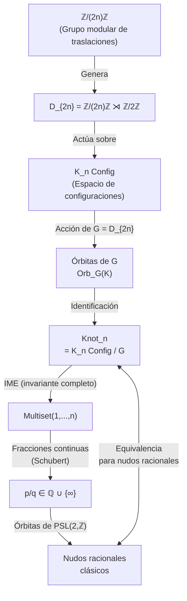

# Un Nudo como Órbita de Grupo Modular
## Concepto Central de la TME (Teoría Modular Estructural)

**Dr. Pablo Eduardo Cancino Marentes** — Desarrollo conceptual, TME_Nudos

---

## 1. La Intuición Central

> **Un nudo puede ser considerado como la configuración de la órbita de un grupo modular.**

Esta frase condensa una relación profunda. Vamos a desarrollarla capa por capa.

En la TME ya tienes construido:
- Un espacio discreto **Z/(2n)Z** donde viven los cruces
- Las **K_n-configuraciones**: matchings perfectos orientados sobre Z/(2n)Z
- El **IME** (Invariante Modular Estructural): código numérico del nudo
- Las **órbitas de D₆** sobre K₃Config (en `TCN_05_Orbitas.lean`)

El concepto nuevo propone dar el paso inverso: **la órbita es el nudo**, no la configuración individual.

---

## 2. La Cadena Conceptual

```
Configuración K ∈ K_n Config   ←→   Punto en el espacio discret Z/(2n)Z
        ↓                                         ↓
Grupo G actúa sobre K_n Config          G actúa por rotaciones/reflexiones
        ↓                                         ↓
  Orb_G(K) ⊆ K_n Config           conjunto de configuraciones equiv.
        ↓                                         ↓
  [K]_G = Orb_G(K)                         Clase de isotopía = NUDO
```

**Tesis**: Dos configuraciones representan el mismo nudo ⟺ están en la misma órbita de G.

---

## 3. Formalización del Concepto

### 3.1 El Grupo Actuante

En tu teoría, el grupo que actúa es el **grupo diédrico D_{2n}**:

- Para K₃: **D₆** (orden 12, ya implementado en `TCN_04_DihedralD6.lean`)
- Para K_n general: **D_{2n}** (orden 4n)

Este grupo captura dos tipos de equivalencia:
1. **Rotaciones** (ℤ/2nℤ): desplazar todo el nudo circularmente
2. **Reflexiones**: invertir la orientación (espejo)

```lean
-- Ya tienes esto en TCN_05_Orbitas.lean:
def orbit (K : K3Config) : Finset K3Config :=
  Finset.univ.image (fun g : DihedralD6 => DihedralD6.actOnConfig g K)
```

### 3.2 La Identificación Nudo ≡ Órbita

La propuesta es definir formalmente:

```lean
-- NUEVO CONCEPTO: Un nudo es una clase de equivalencia
def Knot (n : ℕ) := K_nConfig n ⧸ (orbitRelation DihedralD_{2n})

-- Dos configuraciones representan el mismo nudo ssi:
def sameKnot (K₁ K₂ : K_nConfig n) : Prop :=
  ∃ g : DihedralD_{2n}, g • K₁ = K₂
```

Esto convierte a **Knot n** en el **conjunto cociente** K_nConfig/G.

### 3.3 El IME como Selector Canónico de Órbita

Tu IME ya cumple un rol clave aquí:

```
Orb_G(K) ←→ IME(K)     (para nudos irreducibles)
```

Si el IME clasifica completamente los nudos irreducibles (tu Teorema T5 de completitud), entonces:

```
Nudo K ≡ Nudo K'  ⟺  IME(K) = IME(K')  ⟺  Orb_G(K) = Orb_G(K')
```

El **IME es un invariante completo** = elige un representante canónico de cada órbita.

---

## 4. La Conexión con el "Grupo Modular"

### 4.1 ¿Qué grupo modular?

El término **"grupo modular"** puede referirse a dos cosas con alta relevancia para tu teoría:

#### Opción A: El Grupo Modular PSL(2,ℤ)

El grupo modular clásico PSL(2,ℤ) = SL(2,ℤ)/{±I} actúa sobre:
- El semiplano superior ℍ (geometría hiperbólica)
- Las **fracciones continuas** (clasificación de Schubert)

**Conexión con TME**: Tu archivo `Schubert.lean` ya establece el puente con fracciones continuas. Los nudos racionales se clasifican por p/q ∈ ℚ, y las transformaciones de PSL(2,ℤ) actúan sobre ℚ ∪ {∞}.

```
Nudo racional N(p,q) ~ N(p',q')  ⟺  p/q y p'/q' están en la misma órbita de PSL(2,ℤ)
```

#### Opción B: El Grupo Cociente ℤ/(2n)ℤ (tu grupo modular)

En tu notación, el grupo **ℤ/(2n)ℤ** actúa por traslaciones sobre el espacio de cruces:

```lean
-- Acción de traslación (ya implícita en tu teoría):
def translate (k : ZMod (2*n)) (K : KnConfig n) : KnConfig n :=
  -- desplaza todos los índices de K en k (módulo 2n)
  ...
```

Esto hace que **D_{2n} = ℤ/(2n)ℤ ⋊ ℤ/2ℤ** — el grupo diédrico como extensión semidirecta del grupo modular de traslaciones.

#### Opción C: La Acción Modular sobre el IME

El IME vive en el conjunto de multiconjuntos de {1,...,n}. El **grupo simétrico S_n** actúa sobre él por permutación de componentes. Esto es una acción "modular" en el sentido de módulos libres:

```
IME(K) ∈ Multiset({1,...,n}) = ℕ^n / S_n
```

---

## 5. Proposición Matemática Central (Nueva)

> **Proposición**: Sea K_n el espacio de configuraciones con n cruces sobre ℤ/(2n)ℤ, y sea G = D_{2n} el grupo diédrico actuando por simetrías. Entonces:
>
> 1. El conjunto de nudos con n cruces es el cociente **Knot_n = K_n Config / G**
> 2. El IME es un invariante completo para nudos irreducibles
> 3. La función IME : Knot_n → Multiset(ℕ) es inyectiva en el subcategoría irreducible
> 4. La composición de nudos corresponde a una operación algebraica sobre Knot_n

---

## 6. Diagrama de la Estructura



---

## 7. Pasos de Formalización en Lean 4

### Fase 1: Tipo cociente (NUEVO)

```lean
-- En TMENudos/KN_06_NudoComoCociente.lean (nuevo archivo)
namespace KnotTheory

variable {n : ℕ} [Fact (n > 0)]

/-- Relación de equivalencia: dos configuraciones son el mismo nudo
    si están en la misma órbita de D_{2n} -/
def orbitEquiv (K₁ K₂ : KnConfig n) : Prop :=
  ∃ g : DihedralD_{2n}, g • K₁ = K₂

instance : Equivalence (@orbitEquiv n _) where
  refl K := ⟨1, by simp [MulAction.one_smul]⟩
  symm := fun ⟨g, hg⟩ => ⟨g⁻¹, by rw [← hg, ← MulAction.mul_smul, inv_mul_cancel, MulAction.one_smul]⟩
  trans := fun ⟨g, hg⟩ ⟨h, hh⟩ => ⟨h * g, by rw [MulAction.mul_smul, hg, hh]⟩

/-- El tipo de nudos con n cruces: espacio cociente K_n / D_{2n} -/
def Knot (n : ℕ) [Fact (n > 0)] := Quotient (⟨@orbitEquiv n _, inferInstance⟩)

end KnotTheory
```

### Fase 2: IME como invariante de la clase

```lean
/-- El IME es invariante bajo la acción del grupo -/
theorem ime_invariant_under_action (g : DihedralD_{2n}) (K : KnConfig n) :
    ime (g • K) = ime K := by
  sorry -- Requiere probar que actOnConfig preserva IME

/-- IME desciende al cociente: define IME para nudos -/
def Knot.ime : Knot n → Multiset ℕ :=
  Quotient.lift (fun K => K.ime.toMultiset) (fun K₁ K₂ ⟨g, hg⟩ => by
    rw [← hg, ime_invariant_under_action])
```

### Fase 3: Teorema de clasificación

```lean
/-- Teorema de Clasificación: IME es inyectivo en irreducibles -/
theorem knot_classification_by_ime :
    ∀ K₁ K₂ : Knot n, K₁.isIrreducible → K₂.isIrreducible →
    K₁.ime = K₂.ime → K₁ = K₂ := by
  sorry -- Tu Teorema T5 reformulado como propiedad del cociente
```

---

## 8. Conexión con Matemática Establecida

| Objeto TME | Objeto Matemático Clásico |
|---|---|
| K_n Config / D_{2n} | Espacio de configuraciones de Dehn (nudos en S³) |
| IME | Fracción p/q de Schubert |
| G = D_{2n} | Grupo de simetría de la presentación planar |
| Órbita de G | Clase de isotopía de Reidemeister |
| IME completo | Invariante de Conway / Alexander polynomial |
| PSL(2,ℤ) | Grupo modular de transformaciones de fracciones continuas |

---

## 9. Preguntas Abiertas

1. **¿Qué grupo modular actúa sobre el espacio de IMEs?**  
   El IME vive en `Multiset({1,...,n})`. ¿Qué grupo de simetrías actúa sobre este espacio de manera compatible con la acción de D_{2n} sobre K_n Config?

2. **¿Existe una "fórmula de Burnside" para contar clases de nudos?**  
   ```
   |Knot_n| = (1/|G|) · Σ_{g∈G} |Fix(g)|
   ```
   ¿Puedes calcular |Fix(g)| para cada g ∈ D_{2n} en términos de propiedades modulares?

3. **¿Cuál es la estructura algebraica de Knot_n?**  
   ¿Es un monoide con la composición de nudos? ¿Existen inversos (nudos espejo)?

4. **¿Cómo se relacionan las órbitas bajo PSL(2,ℤ) con las órbitas bajo D_{2n}?**  
   Para nudos racionales, ambas clasificaciones deberían coincidir.

---

## 10. Ruta de Desarrollo Sugerida

```
Paso 1: Definir formalmente Knot n como Quotient (NUEVO archivo)
         └── Usar Quotient.mk' en Lean 4 / Mathlib
         
Paso 2: Probar que IME es un invariante (ime_invariant_under_action)
         └── Requiere analizar cómo actOnConfig afecta pairDelta
         
Paso 3: Enunciar Teorema de Clasificación como propiedad del cociente
         └── Reformular tu Teorema T5 en términos de Knot n
         
Paso 4: Conectar con Schubert / fracciones continuas
         └── Nudo racional N(p,q) ↔ IME ↔ p/q
         └── Acción de PSL(2,ℤ) sobre ℚ ↔ acción de D_{2n} sobre K_n
         
Paso 5: Fórmula de Burnside → contar nudos distintos con n cruces
         └── Verificar con tablas conocidas de teoría de nudos
```
