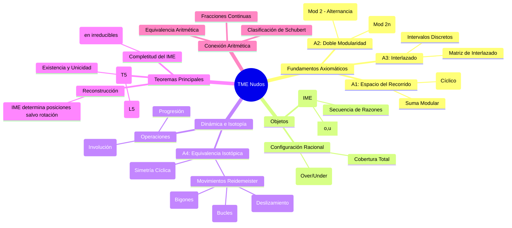

# Mapa Mental: Teoría Modular Estructural de Nudos (TME)

Este diagrama visualiza el eje discursivo de la teoría, desde sus axiomas fundamentales hasta los teoremas de clasificación, basado en la formalización en `Basic.lean`.

## Descripción del Eje Discursivo

1.  **Fundamentación**: La teoría parte de definir un espacio discreto y finito (`ℝ[n]`) donde "habitan" los nudos, regido por aritmética modular.
2.  **Estructuración**: Sobre este espacio se definen los **Cruces** y su **Interlazado**, creando la `RationalConfiguration`.
3.  **Caracterización**: Se extrae la esencia del nudo en el **IME** (Invariante Modular Estructural), una lista de números que codifica la geometría.
4.  **Dinámica**: Se define cuándo dos nudos son equivalentes (`Isotopic`) mediante movimientos locales (R1, R2, R3) y globales (Rotación).
5.  **Clasificación**: El punto culminante es demostrar que el IME es un "código de barras" perfecto: dos nudos irreducibles son iguales si y solo si sus IMEs son iguales.
6.  **Puente Aritmético**: Finalmente, se conecta esta visión combinatoria con la teoría clásica de fracciones continuas.
